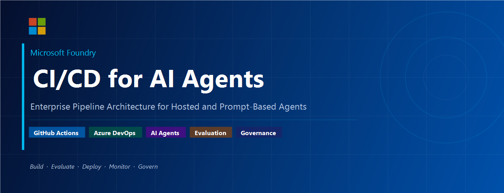
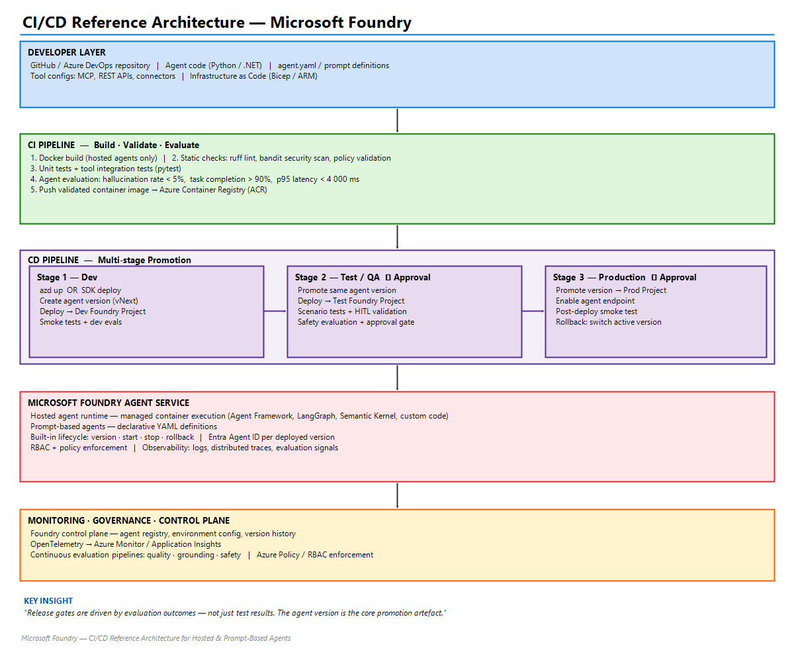

# CI/CD for AI Agents on Microsoft Foundry

Reference pipelines for building, validating, evaluating, and promoting AI agent versions across Dev, Test, and Production using:

- GitHub Actions
- Azure DevOps Pipelines
- Microsoft Foundry

Reference blog post:

- [CI/CD for AI Agents on Microsoft Foundry](https://techcommunity.microsoft.com/blog/educatordeveloperblog/cicd-for-ai-agents-on-microsoft-foundry/4522218)

## Architecture

## Repository Contents

- `github-actions-pipeline.yml`: End-to-end GitHub Actions workflow for CI/CD.
- `azure-devops-pipeline.yml`: Multi-stage Azure DevOps pipeline for CI/CD.
- `banner.png`: Banner image used in documentation.
- `architecture-diagram.png`: Architecture diagram for the deployment model.

## Pipeline Summary

Both pipelines implement the same lifecycle:

1. CI Build and Validation
2. Evaluation quality gates
3. Deploy to Dev
4. Promote to Test/QA
5. Deploy to Production with approvals

### CI (Build, Validate, Evaluate)

- Dependency installation and Python setup
- Static analysis (`ruff`) and security scan (`bandit`)
- Agent configuration validation (`agent.yaml` and prompt definitions)
- Unit and integration tests (`pytest`)
- Evaluation dataset execution and gate enforcement
- Artifact publishing for evaluation results

### CD (Promotion Across Environments)

- Deploy validated agent version to Dev
- Run smoke tests in Dev
- Promote the same version to Test/QA
- Run scenario and safety evaluations in Test
- Promote to Production with environment approval gates
- Post-deployment smoke testing in Production

## Pipeline Files

- GitHub Actions workflow: `github-actions-pipeline.yml`
- Azure DevOps pipeline: `azure-devops-pipeline.yml`

## Required Secrets and Variables

The pipeline files are configured to use secret and variable references, not hardcoded credentials.

Examples:

- GitHub: `${{ secrets.AZURE_CLIENT_ID }}`, `${{ secrets.FOUNDRY_CONNECTION_STRING_PROD }}`
- Azure DevOps: `$(AZURE_OPENAI_API_KEY)`, `$(FOUNDRY_CONNECTION_STRING_PROD)`

## Governance Files

- License: `LICENSE` (MIT)
- Contributing guide: `CONTRIBUTING.md`
- Security policy: `SECURITY.md`

## Public Sharing Readiness

This repository is structured for public sharing:

- No hardcoded secrets were found in the tracked pipeline files.
- Credentials are referenced through secret stores and variable groups.
- Standard open-source governance files are included.

Before publishing, verify repository settings:

1. Configure branch protections for `main`.
2. Require pull requests and status checks for protected branches.
3. Enable secret scanning and dependency alerts in your hosting platform.
